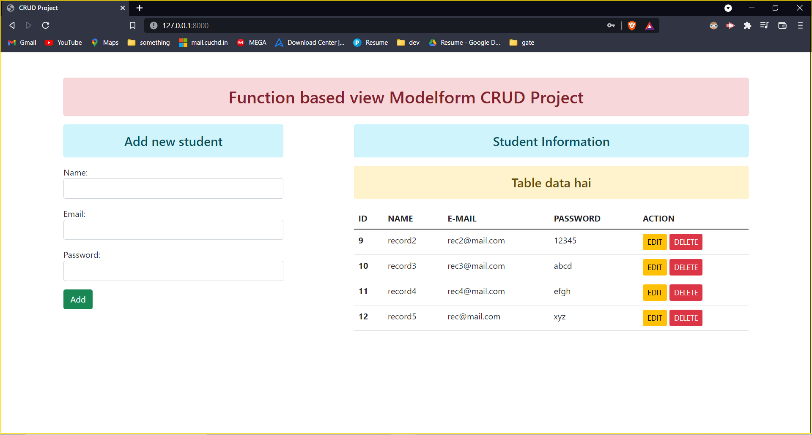
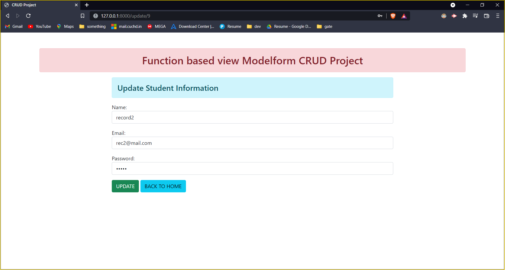
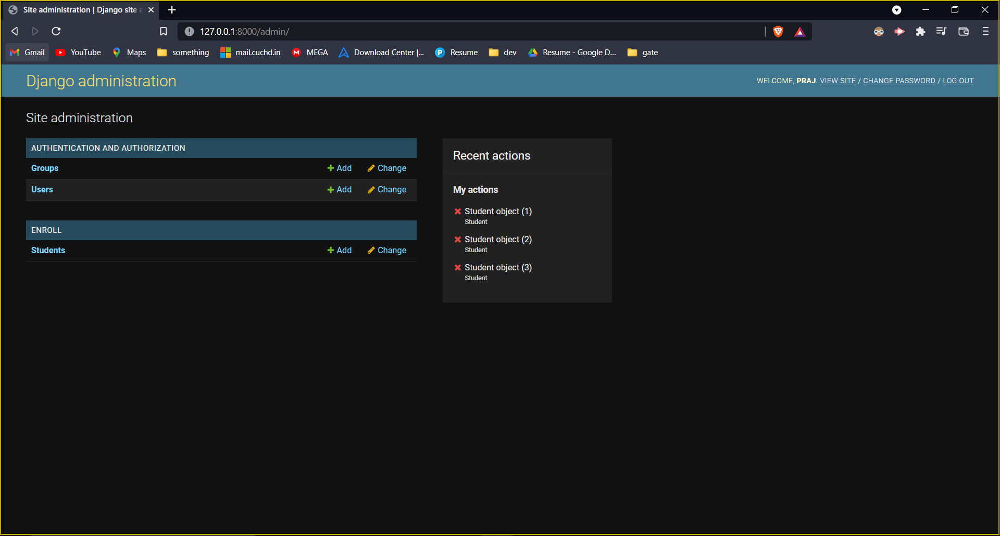
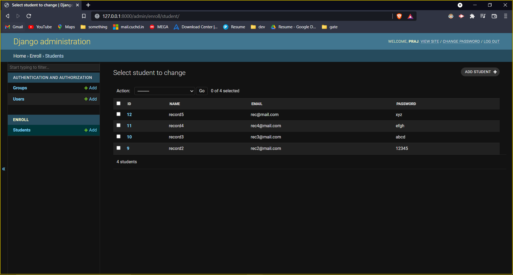
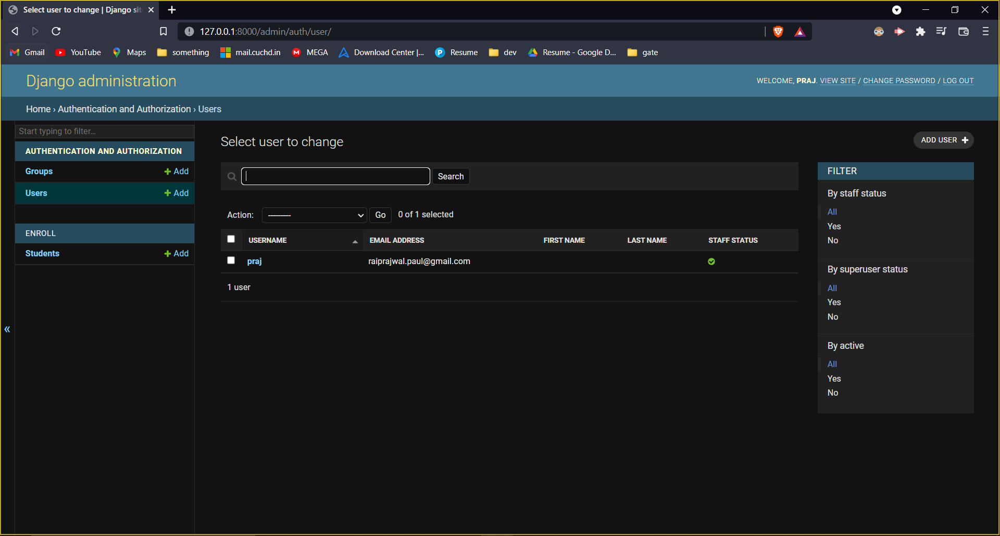

# CRUD Project

### In this application I have used function based view and ModelForm and implemented CRUD operations using them.

## DEMO:

1. HOME VIEW:

    

2. Edit page:

    

3. Admin Interface:

    

4. Students Table:

    

5. Users Table:

    

This is a mini project to implement basic CRUD operations in a django powered web application. This is part of my project based learning.